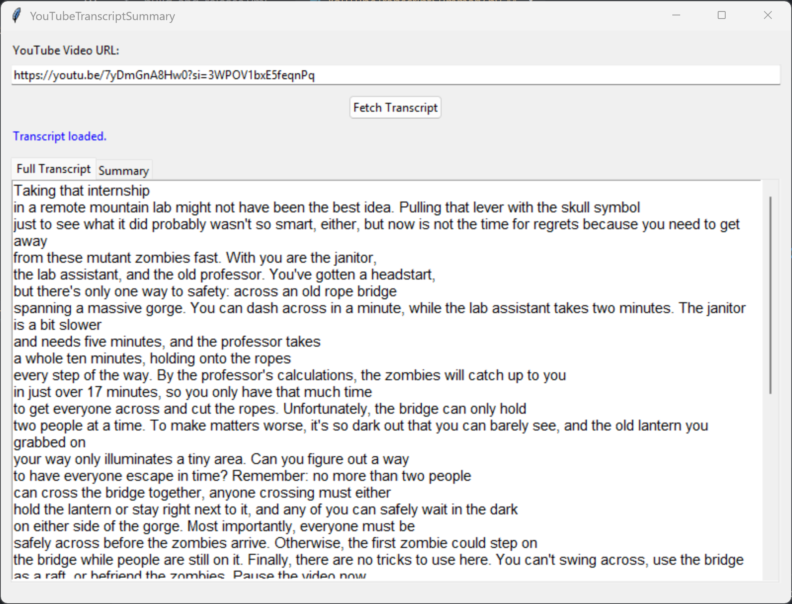
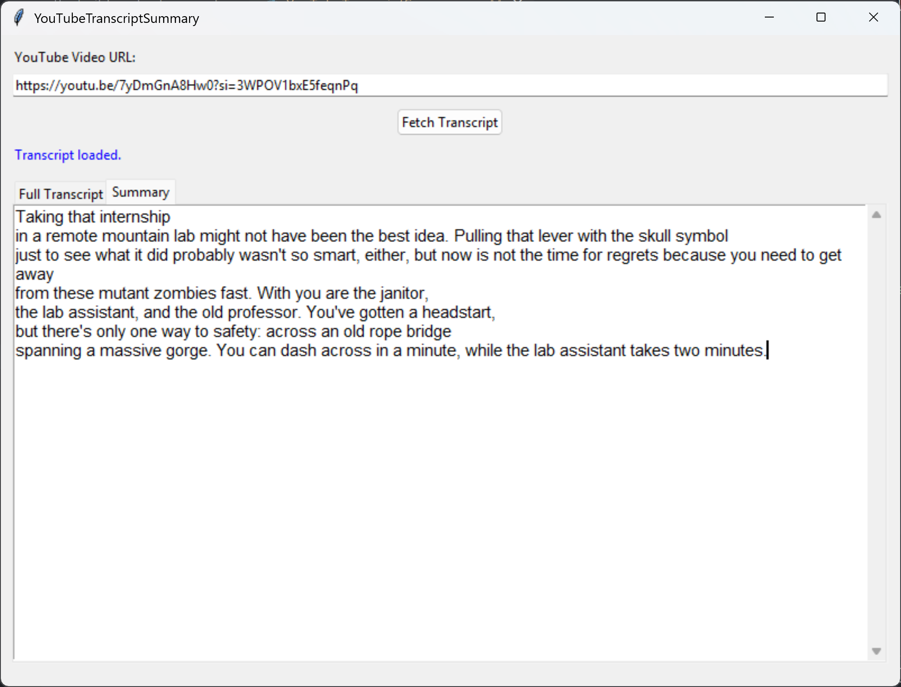

  
  

---

## 🧾 About This Project

This project showcases:

- YouTube transcript and metadata extraction using `pytube`  
- GUI development with `tkinter`  
- Modular, beginner-friendly Python structure  
- A real-world solution for video analysis and automation

---

## 🎓 Academic Context: BHCC Contribution

This project was developed as part of **PROJECT 5: MOBILE APP DEVELOPMENT**  
for the course **CIT-113-01: Info Tech Problem Solving** at **Bunker Hill Community College (BHCC)** during the Spring 2025 semester.

The course emphasizes:

- Project-based learning (PBL) with real-world relevance  
- Ethical and responsible software development  
- Creative problem solving and independent thinking  
- A blended approach: online learning + live collaboration  

> 💬 *"The goal isn’t just to code — it’s to build tools that help people make sense of their digital world."*

This project aligns with course learning outcomes:

- Apply Python to solve practical digital tasks  
- Build interactive GUI applications  
- Use APIs and protocols responsibly  
- Reflect critically on the role of technology in society

---

## 🔽 Download

📦 **Get the latest executable:**  
👉 [Download YouTubeTranscriptSummary (.exe)](https://github.com/jentimanatol/YouTubeTranscriptSummary/releases/latest)

📁 **Browse or fork the source:**  
🔍 [Explore all releases](https://github.com/jentimanatol/YouTubeTranscriptSummary/releases)

---

## 🧑‍🏫 Who Should Use This?

- 🎓 **Students** analyzing YouTube videos for assignments or presentations  
- 🎥 **Content creators** reviewing video metadata and performance  
- 🧑‍💼 **Researchers or journalists** retrieving and archiving video info  
- 🗃️ **Archivists** organizing YouTube content efficiently

Whether you're studying trends, managing digital collections, or analyzing content performance — this app helps you save time and increase accuracy.

---

## ⚙️ How It Works

1. **Paste a YouTube link into the app**  
2. **Click “Analyze”** to fetch metadata and transcript  
3. **Optionally download** the video or audio  
4. ✅ Review, save, or export the results

Robust error handling ensures reliable results across different video types and formats.

---

## 🖼️ App Preview

  
  

*A clean and intuitive interface for video research and transcript analysis.*

---

## 💡 Why I Built This

YouTube is a vast archive of educational, cultural, and social content — but extracting structured data from it can be time-consuming.

This app was built to simplify metadata and transcript collection for:

- Academic research  
- Content organization  
- Digital media analysis  

It reflects my passion for:

- Automation and digital efficiency  
- Media and data literacy  
- Accessible open-source tools  
- Clean, practical UI design

---

## 🛠 Tech Stack

- `Python 3.11+`  
- `pytube` — for video/transcript extraction  
- `tkinter` — for the graphical user interface  
- `os`, `threading`, `datetime` — core functionality  
- `matplotlib` — optional for visual data plots

Optional tools:

- `pyinstaller` — for building `.exe` distributions  
- `pydub` — for advanced audio conversion

---

## 📃 License & Credits

🆓 **MIT License** — use, modify, and share freely.

👤 Developed by **Anatolie Jentimir**  
🎓 Created for **Bunker Hill Community College** coursework
